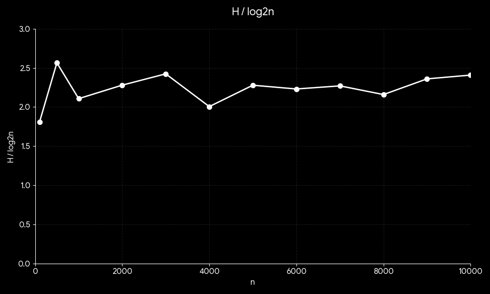

# 41343153
# Quit_1 Max/Min Heap


## 解題說明
本題目要求實作一個 最小優先佇列（Min Priority Queue），並使用 最小堆積（Min Heap） 作為底層資料結構。

### 解題策略
#### 資料結構
- Min Priority Queue 抽象類別
- MinHeap 類別設計
#### 主要操作方法
1.插入元素（Push):當新元素加入時，先放在陣列最後，再進行「向上調整（Heapify Up）」：
- 與父節點比較
- 若較小則交換
- 重複直到符合 MinHeap 性質

2.刪除最小值（Pop:最小值位於根節點（heap[1]），刪除後：
- 以最後一個元素補上根節點
- 進行「向下調整（Heapify Down）」
- 與較小子節點比較並交換

3.取得最小值（Top）
```cpp
  heap[1]
```

4.動態擴充（Resize):當陣列空間不足時：
- 建立新陣列（容量加倍）
- 複製原資料

## 程式實作
```cpp
#include <iostream>
#include <string>
#include <stdexcept>

using namespace std;

template <class T>
class IMinPriorityQueue {
public:
    virtual ~IMinPriorityQueue() {}
    virtual bool IsEmpty() const = 0;
    virtual const T& Top() const = 0;
    virtual void Push(const T& item) = 0;
    virtual void Pop() = 0;
};

template <class T>
class MinHeap : public IMinPriorityQueue<T> {
private:
    T* elements;
    int maxCapacity;
    int currentCount;

    void ExpandCapacity() {
        maxCapacity *= 2;
        T* newElements = new T[maxCapacity + 1];
        
        for (int i = 1; i <= currentCount; i++) {
            newElements[i] = elements[i];
        }
        delete[] elements;
        elements = newElements;
    }

public:
    MinHeap(int initialCapacity = 10) {
        maxCapacity = initialCapacity;
        elements = new T[maxCapacity + 1]; 
        currentCount = 0;
    }

    ~MinHeap() {
        delete[] elements;
    }

    bool IsEmpty() const override {
        return currentCount == 0;
    }

    const T& Top() const override {
        if (IsEmpty()) {
            throw runtime_error("目前是空的，無法取得頂端元素！");
        }
        return elements[1];
    }

    void Push(const T& newItem) override {
        if (currentCount + 1 == maxCapacity) {
            ExpandCapacity();
        }

        int currentIndex = ++currentCount;

        while (currentIndex != 1 && newItem < elements[currentIndex / 2]) {
            elements[currentIndex] = elements[currentIndex / 2];
            currentIndex /= 2;
        }

        elements[currentIndex] = newItem;
    }

    void Pop() override {
        if (IsEmpty()) {
            throw runtime_error("已經空了，無法刪除");
        }

        T lastElement = elements[currentCount--];

        int parentIndex = 1;
        int childIndex = 2;

        while (childIndex <= currentCount) {
            if (childIndex < currentCount && elements[childIndex] > elements[childIndex + 1]) {
                childIndex++;
            }

            if (lastElement <= elements[childIndex]) {
                break;
            }

            elements[parentIndex] = elements[childIndex];
            parentIndex = childIndex;
            childIndex *= 2;
        }

        elements[parentIndex] = lastElement;
    }

    void PrintByIndex() const {
        if (IsEmpty()) {
            cout << "沒元素。" << endl;
            return;
        }
        
        for (int i = 1; i <= currentCount; i++) {
            cout << elements[i] << (i == currentCount ? "" : " -> ");
        }
        cout << endl;
    }
};

int main() {
    MinHeap<int> myMinHeap;
    int totalItems, inputValue;

    cout << "test Min-Heap" << endl;
    cout << "請輸入n個數字：";
    cin >> totalItems;

    cout << "請依序輸入 " << totalItems << " 個元素 ：\n> ";
    for (int i = 0; i < totalItems; i++) {
        cin >> inputValue;
        myMinHeap.Push(inputValue);
    }

    cout << "\n目前 Heap 的內部陣列結構 ：\n";
    myMinHeap.PrintByIndex();
    cout << "=======================================" << endl;

    return 0;
}
```
## 效能分析
### 時間複雜度
- 插入操作（Push）:插入新元素時，需進行向上調整
```cpp
O(log n)
```
- 刪除最小值（Pop）:刪除 root 後，需進行向下調整
```cpp
O(log n)
```
- 取得最小值（Top）:直接存取根節點
```cpp
O(1)
```
- 判斷是否為空（IsEmpty）:僅檢查 size
```cpp
O(1)
```
### 空間複雜度
- 使用陣列儲存：O(n)
- 動態擴充後仍為：O(n)
## 測試與驗證

### 測試案例
| 測試案例 | 請輸入n個數字： | 依序輸入 5 個元素 ： | 實際輸出 | 
|----------|--------------|----------|----------|
| 測試一   |   5  |     1 2 3 4 7        |     目前 Heap 的內部陣列結構 ：1 -> 2 -> 3 -> 4 -> 7    | 

### 結論
以 Min-Heap 實作最小優先佇列，透過 Template 提高類型通用性。程式採用 1-based 陣列簡化二元樹索引計算，並實作動態擴充與上下調整機制。經測試，系統能穩定維持堆積性質，確保 $O(\log n)$ 的操作效率。
## 申論及開發報告

### 開發目的

本程式的目標是以最小堆（MinHeap）實作一個最小優先佇列（MinPQ）的抽象介面，提供以下基本操作:
- IsEmpty()：判斷優先陣列是否為空
- Top()：取得目前最小元素（不刪除）
- Push(x)：插入一個新元素
- Pop()：刪除目前最小元素 -（額外功能）PrintByIndex()：以陣列索引順序輸出堆的內容（用於檢查）
### 開發環境與語言
- 語言：C++
- 編譯器：g++ / clang++（建議 C++11 以上）
- 主要標頭：<iostream>, <string>（備註：程式有用到 runtime_error，建議補上 #include <stdexcept> 以符合標準。）
### 資料結構與設計概念
- 最小堆（Min-Heap）性質,最小堆是一種完全二元樹，滿足：
  - 每個節點的值 <= 其子節點的值 
  - 因此根節點（root）永遠是最小值
- 陣列表示法,本程式用動態陣列 heap[] 存堆，並從索引 1 開始（常見寫法）：
  - heap[1]：根（最小值）
  - 對於索引 i：
    - parent = i/2
    - left child = 2*i
    - right child = 2*i + 1
### 模組設計與類別說明
- 抽象介面 MinPQ<T>
  使用 virtual 宣告純虛函式，定義最小優先佇列應有的行為，讓不同實作（例如 heap、leftist heap 等）可以共用同一套介面。

- 具體實作 MinHeap<T>
  主要成員：

    - T* elements：存資料的動態陣列
    - int maxCapacity：容量
    - int currentCount：目前元素量（堆大小）
    - 並提供：
      - Resize()：當容量不足時，將容量倍增並搬移資料
# Quit_2 Binary Search Tree

## 解題說明
### 題目說明 
本程式主要在探討 二元搜尋樹（Binary Search Tree, BST）在隨機插入情況下的高度變化
### 實作方法
- 建立一棵 空的 Binary Search Tree (BST)
- 插入 n 個隨機數
- 計算樹的高度 height: h(n)=1+max(h(left),h(right))
- 計算比值：height/ $\log_2 n$ 

## 程式實作
```cpp
#include <iostream>
#include <cmath>
#include <cstdlib>
#include <ctime>
#include <iomanip>

using namespace std;

struct Node {
    int key;
    Node* left;
    Node* right;
    Node(int k) : key(k), left(nullptr), right(nullptr) {}
};

Node* insert(Node* root, int key) {
    if (!root) return new Node(key);
    if (key < root->key) root->left = insert(root->left, key);
    else if (key > root->key) root->right = insert(root->right, key);
    return root;
}

int height(Node* root) {
    if (!root) return 0;
    int hl = height(root->left);
    int hr = height(root->right);
    return 1 + (hl > hr ? hl : hr);
}

void destroy(Node* root) {
    if (!root) return;
    destroy(root->left);
    destroy(root->right);
    delete root;
}

void shuffleArray(int* a, int n) {
    for (int i = n - 1; i > 0; --i) {
        int j = rand() % (i + 1);
        int temp = a[i];
        a[i] = a[j];
        a[j] = temp;
    }
}

int main() {
    srand((unsigned)time(nullptr)); 

    int ns[] = { 100, 500, 1000, 2000, 3000, 4000, 5000, 6000, 7000, 8000, 9000, 10000 };
    int len = sizeof(ns) / sizeof(ns[0]);

    cout << left << setw(10) << "n" 
         << setw(10) << "height" 
         << "height/log2(n)" << endl;
    cout << "---------------------------------------" << endl;

    for (int i = 0; i < len; ++i) {
        int n = ns[i];
        Node* root = nullptr;

        int* arr = new int[n];
        for (int j = 0; j < n; ++j) arr[j] = j + 1;

        shuffleArray(arr, n);
        for (int j = 0; j < n; ++j) {
            root = insert(root, arr[j]);
        }

        int h = height(root);
        double ratio = h / log2((double)n);

        cout << left << setw(10) << n 
             << setw(10) << h 
             << fixed << setprecision(4) << ratio << "\n";

        delete[] arr;
        destroy(root);
    }

    return 0;
}
```
## 效能分析
### 時間複雜度
- 插入與搜尋時間複雜度:BST 的時間複雜度取決於樹的高度

|高度| 時間複雜度  |
|----------|--------------|
| $\log_2 n$ | O(logn) |
|  n |  O(n)|

### 空間複雜度
- 每個節點：𝑂(1)
- 總空間：𝑂(𝑛)

### 線性圖

## 結論
本實驗證明了隨機輸入能有效防止二元搜尋樹（BST）退化。實驗數據顯示，當輸入順序隨機化時，樹高 $h$ 會維持在 $O(\log n)$ 左右，與 $\log_2 n$ 的比值趨於穩定，確保了搜尋效能不會因資料量增加而急劇下降。

## 申論及開發報告
### 開發目的
本次開發目標為完成二元搜尋樹（Binary Search Tree, BST）的兩項任務：
(a) 隨機插入實驗：
- 從空 BST 開始，對不同規模 n 進行隨機插入並量測樹高 height，計算 height/log2(n)，驗證此比值是否近似常數。

(b) BST 刪除功能：
- 撰寫 C++ 函式刪除 key 為 k 的節點，並分析該函式的時間複雜度。
- 
### 開發環境與工具
- 語言：C++
- 編譯環境：g++ / clang++（C++11 以上皆可）
- 主要使用標頭：
  - (a) iostream, cmath, cstdlib, ctime（不使用 unordered_set）
  - (b) iostream
  
### 系統設計與資料結構
- 節點結構（Node）
  - key：用於 BST 排序的鍵
  - left：左子樹指標
  - right：右子樹指標 
### 模組設計
#### 樹運算模組：

insert()：遞迴插入節點，維持 BST 左小右大特性。

height()：遞迴計算樹的最大深度。

destroy()：遞迴釋放節點記憶體，避免洩漏。

#### 實驗模組：

測試 $n = 100$ 到 $10,000$ 的不同規模。計算 $h / \log_2 n$ 比值，觀察樹的平衡狀態。
#### 格式化模組：

使用 setw 與 setprecision 產出整齊的數據表格。
